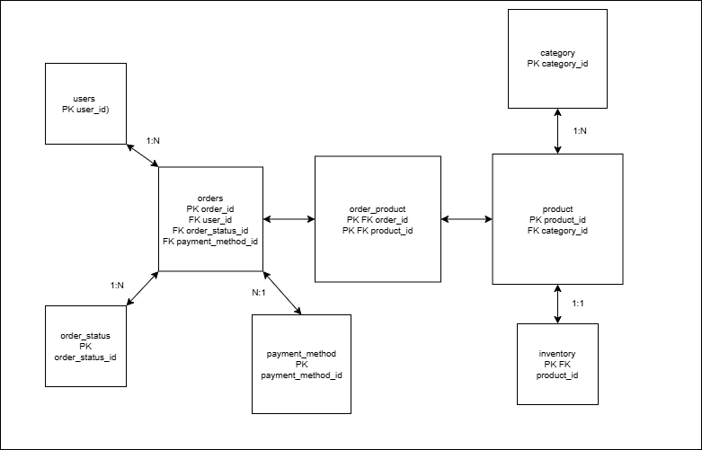

# 🧠 Sistema de Gestión de Pedidos e Inventario

Este proyecto fue desarrollado como parte del proceso formativo en programación. El sistema simula una tienda con pedidos y gestión de inventario, permitiendo registrar usuarios, realizar compras y administrar productos y pedidos desde consola. Todo está estructurado por roles (usuario/administrador) y separado en múltiples scripts para mayor organización.

---

## 📌 Funcionalidades Principales

El sistema cuenta con **dos menús completamente funcionales**:

### 👤 Menú de Usuario:
- Realizar pedido (Registro de usuario + registro de pedido)
- Pagar pedido (Busqueda del pedido + pago de pedido si existe)
- Ver estado de mi pedido (Busqueda de los pedidos + mostrar pedidos si existen)
- Cancelar pedido (Busqueda del pedido + Eliminacion del pedido si existe y se confirma)
- Opciones de administrador (Abre el menu de administrador con clave)
- Salir del sistema (Cierra el sistema)

### 🛠 Menú de Administrador:
- Ver todos los pedidos (Muestra pedidos si existen)
- Ver inventario" (Muestra inventario si existen)
- Ajustar stock" (Busqueda de productos + Modificacion del stock)
- Salir (Cierra el menu de admin y devuelve al menu principal)
- Todo validado con `try`, `except`, ciclos y banderas

---

## 🧱 Base de Datos Relacional

El proyecto usa una base de datos **MySQL** con relaciones normalizadas y FK, se definieron las PK de cada tabla, los campos que podrian ser nulos y los que no, y se definieron campos como el precio, descripcion y nombre de productos.
La base de datos se trabajó directamente desde Python conectando a la base, y se manejan múltiples tablas relacionadas:

- `users`
- `products`
- `category`
- `inventory`
- `payment_method`
- `order_status`
- `orders`
- `order_products` (tabla intermedia entre `orders` y `products`)

📎 Diagrama relacional:



---

## 🧠 Aprendizajes Clave

A lo largo del proyecto se practicaron y consolidaron varios conocimientos clave:

- Conexión entre **Python y MySQL** para manejar datos de forma dinámica
- Diseño de **bases de datos relacionales**, con relaciones `1:1`, `1:N` y `N:N`
- Creación y manipulación de tablas con claves primarias y foráneas
- Realizacion de consultas desde python
- Control del tiempo de vida de las consultas para evitar sobrecargas
- Separación del código en scripts:
  - `main.py` → menú principal
  - `users_functions.py` → funciones para usuarios
  - `menu_admin.py` → menu del administrador
  - `admin_functions.py` → funciones para el administrador
- Validación constante de datos ingresados por el usuario
- Uso de `while`, `for`, `try`, `except`, `if`, `elif`, `else` para controlar el flujo
- Banderas para mantener estados de sesión y navegación
- Mejora de experiencia con `time.sleep()` para dar tiempo a leer mensajes
- Buenas prácticas en organización y claridad del código 

---

## 🛠 Tecnologías Utilizadas

- Python 3
- MySQL
- MySQL Connector/Python
- Terminal / Consola

---

## ▶️ Cómo Ejecutar

1. Asegúrate de tener:
   - Python 3 instalado
   - Un servidor MySQL activo con la base de datos creada
   - El módulo `mysql-connector-python` instalado:

```bash
pip install mysql-connector-python